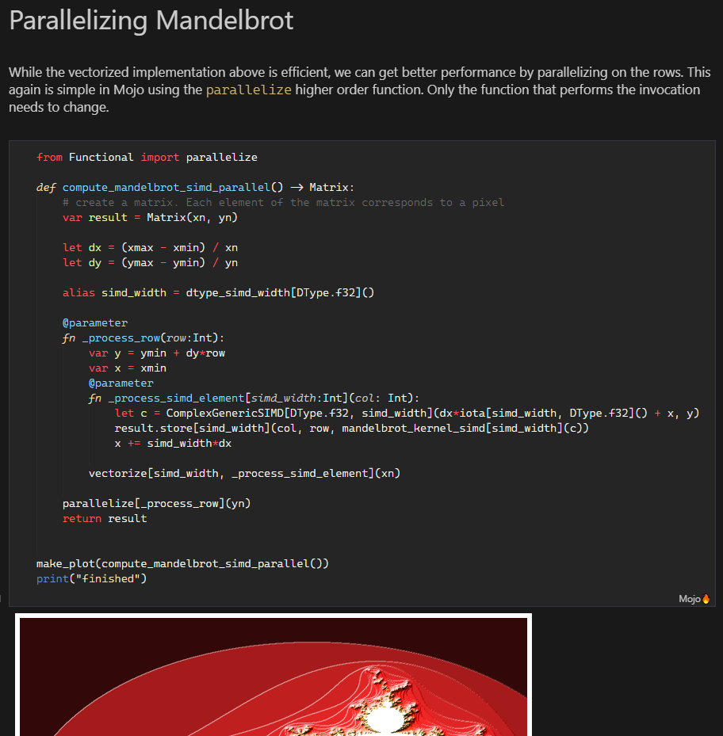

# Mojo🔥 Syntax

This [VS Code](https://code.visualstudio.com/) extension provides syntax highlighting for the [Mojo🔥 programming language](https://github.com/modularml/mojo).  
It is based on the syntax information provided in the [mojo-syntax](https://github.com/modularml/mojo-syntax) repository.

## Features

Syntax highlighting in the editor 

  
(Example code from [Mojo linguist samples](https://github.com/modularml/linguist/blob/mojo/samples/Mojo/Matmul.mojo))

and in notebooks

  
(Example code from the [Mojo Playground](https://playground.modular.com/))

  

  

## Release Notes

### 1.0.0

Initial release
