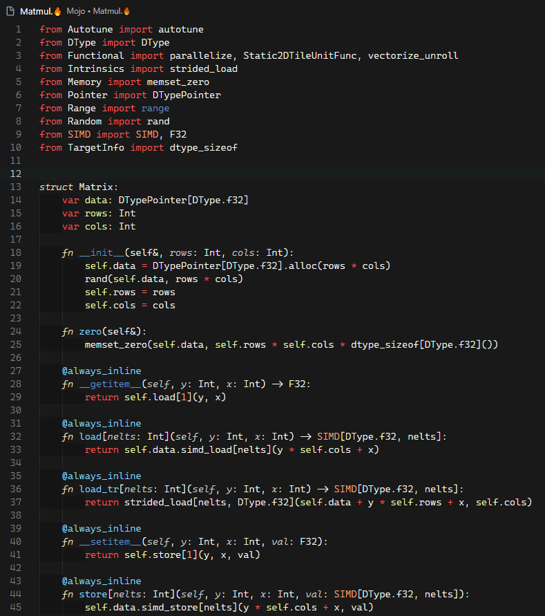
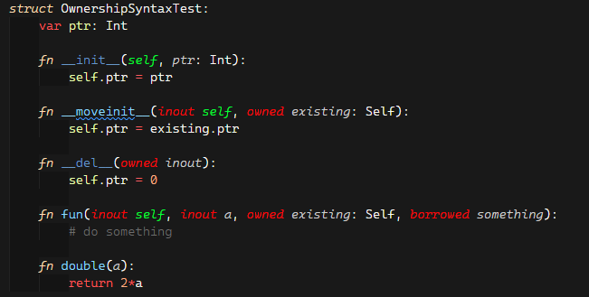

# Mojo🔥 Syntax

This [VS Code](https://code.visualstudio.com/) extension provides syntax support for the [Mojo🔥 programming language](https://github.com/modularml/mojo) ([Docs](https://docs.modular.com/mojo/)).  
It is based on the syntax information provided in the [mojo-syntax](https://github.com/modularml/mojo-syntax) repository.


## Features

Provides syntax highlighting, bracket matching, code folding, and indenting for Mojo🔥 files in the editor 

  
(Example code from [Mojo linguist samples](https://github.com/modularml/linguist/blob/mojo/samples/Mojo/Matmul.mojo))

and for Mojo🔥 code cells in notebooks

  
(Example code from the [Mojo Playground](https://playground.modular.com/))

  

  


Please note that this extension is not an official product and is not associated with the Mojo🔥 development team or [Modular](https://www.modular.com/). It is developed and maintained with the intention of providing a useful tool for Mojo🔥 developers until official support is fully implemented in VS Code.


## Getting Started

1. Install the Mojo🔥 VS Code Extension from the [VS Code Marketplace](https://marketplace.visualstudio.com/items?itemName=Karsten7.mojo-vscode).
2. Open or create a file with the `.mojo` or `.🔥` extension to automatically enable syntax highlighting and other language features.
3. Use the `mojo` language identify to customize Mojo🔥 specific settings.
4. Start coding with Mojo🔥 and enjoy the enhanced support provided by the extension.


### Connecting VSCode to the Mojo Playground
Check out the [wiki](https://github.com/Karsten7/mojo-vscode/wiki#2-connecting-vscode-to-the-mojo-playground) on how to connect your local VSCode to the JupyterHub of the Mojo Playground. 


## Contributing

This extension is an open-source project, and community contributions are welcome. If you encounter any issues, have feature requests, or would like to contribute code improvements, please visit the project repository on [GitHub](https://github.com/Karsten7/mojo-vscode). 

For fixes and improvements to the syntax that also apply to Python, pull requests should be opened against the [MagicPython](https://github.com/MagicStack/MagicPython) project. For Mojo-specific syntax issues and improvement, the official [mojo-syntax](https://github.com/modularml/mojo-syntax) repository should be the right place.

For anything beyond the syntax file or if you're unsure where the right place is, please create a [pull request](https://github.com/Karsten7/mojo-vscode/pulls) or [issue](https://github.com/Karsten7/mojo-vscode/issues) on [this extensions' GitHub page](https://github.com/Karsten7/mojo-vscode).


## Current Intentional Syntax Deviations 

Currently the syntax file intentionally deviates form the official [mojo-syntax](https://github.com/modularml/mojo-syntax) for ownership related markers on argument names. The change introduced in the merged pull request titled ["Update the Mojo syntax file for the May 11 release"](https://github.com/modularml/mojo-syntax/pull/2) is not applied. Instead `inout`, `owned`, and `borrowed` can be highlighted by using the `"variable.parameter.function.ownership"` scope that is implemented in the syntax file of this project. Furthermore, all `.python` have been replaced by `.mojo` throughout the syntax file.

Example:  


With the following settings within the `.code-workspace` file of that file's workspace:

```json
  "settings": {
    "editor.tokenColorCustomizations": {
      "textMateRules": [
        {
          "scope": "variable.parameter.function.ownership",
          "settings": {
            "foreground": "#FF0000"
          }
        },
        {
          "scope": "variable.parameter.function.language.special.self",
          "settings": {
            "foreground": "#00FF00"
          }
        }
      ]
    }
  }
```


## Disclaimer

Please be aware that this extension is in no way officially endorsed, supported, or affiliated with the Mojo🔥 development team or [Modular](https://www.modular.com/). It is a community-driven effort to provide temporary support for Mojo🔥 in VS Code until official support becomes available.


## Release Notes

### 1.0.0

Initial release
